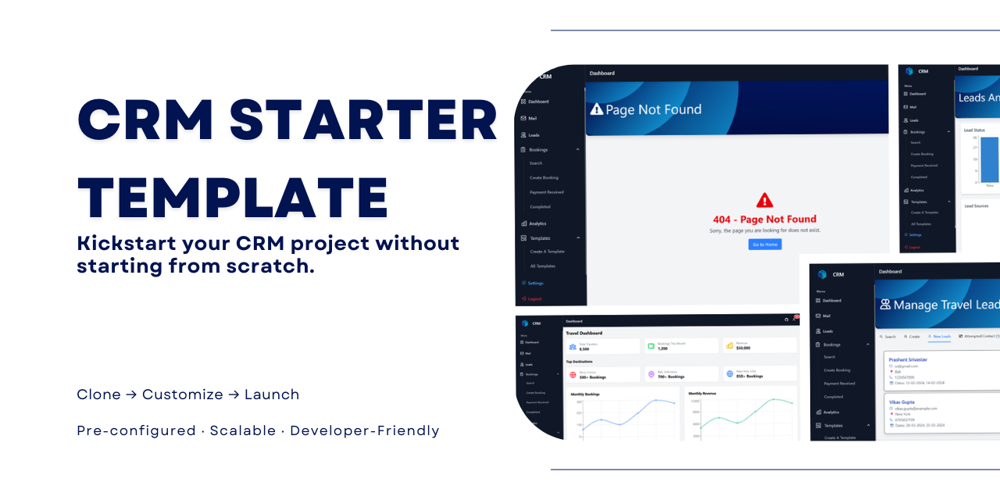
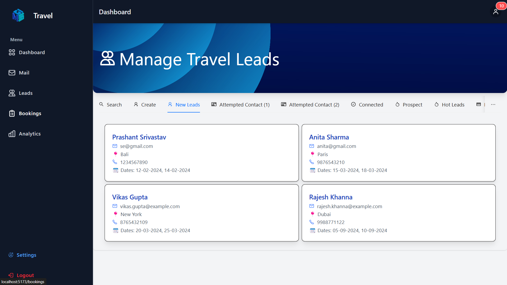

# 📊 React-Vite Dashboard




## 🚀 Overview

This is a **fully responsive** dashboard built using **React, Vite, TypeScript, and Tailwind CSS**. It provides a sleek and modern UI for analytics, user management, and real-time updates. Anyone can use it for their project or clone and customize it.

## 🌍 Live Demo

🔗 **[View Live Dashboard](https://template.dashboard.techorbitals.in)**

* To log in, enter a valid email and a randomly generated password of at least 6 characters.

## 🛠 Tech Stack

* **React** + **Vite** for fast development
* **TypeScript** for better type safety
* **Tailwind CSS** for responsive and modern styling
* **Ant Design** for UI components (optional)
* **Recharts** for data visualization (graphs & charts)

## 🎨 Features

✅ **Responsive Layout** – Works on mobile, tablet, and desktop
✅ **Modern UI** – Clean and user-friendly interface
✅ **Dashboard Widgets** – Analytics, user stats, and reports
✅ **Charts & Graphs** – Visual representation of data
✅ **Reusable Components** – Easily extend for new features

## 📸 Screenshots




## 🛠 Installation & Setup

1️⃣ **Clone the repository**

```sh
git clone https://github.com/sangamprashant/crm-dashboard-template-react.git
```

2️⃣ **Navigate to the project folder**

```sh
cd dashboard-template-react
```

3️⃣ **Install dependencies**

```sh
yarn install  # or npm install
```

4️⃣ **Run the development server**

```sh
yarn dev  # or npm run dev
```

## 🔄 Reset to Template

If you’ve made changes and want to reset your project to the original template:

```sh
yarn reset-project
```

This will:

* Rename the current `src` folder to `src-example` (backup of your changes)
* Rename `src-init` to `src` (restoring the template code)

Then you can run:

```sh
yarn dev
```

to start fresh.

## 📌 Usage

* Modify `src/components/` to customize UI elements.
* Update `src/pages/Dashboard.tsx` to add new widgets.
* Use `src/hooks/` for managing data fetching & state.

## 📢 Contributing

Feel free to contribute by opening **issues** or **pull requests**!

---

### 🌟 **Star this repo if you like it!** ⭐